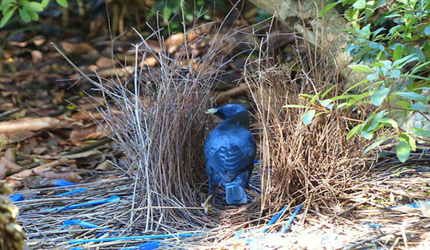

# Bowerbird

Bowerbird is a WordPress plugin update install tool. It simplifies the process of pulling free updates from [WordPress Packagist](https://repo.packagist.org) or premium updates from a subscription, then pushing them to Git and adding version tags to a private repository like Satis, if needed. Named after a very industrious creature who excels at building.



## Prerequisites

- Login information to download the updated package. -- ***premium content only*** --

- Googles' [Go language](https://go.dev) installed to enable building executables from source code.

- An *common* folder in `~/Documents/` shared between [Silkworm](https://github.com/nausicaan/bowerbird.git) and Bowerbird.

A `jira.json` file containing your API URL and Bearer token to enable JQL searching, along with predefined query strings:

``` go
{
    "base": "Jira Issue base URL",
    "token": "Jira Bearer Token",
    "todo": "search?jql=", // JQL search to capture the contents of the "To Do" swimlane
    "testing": "search?jql=", // JQL search to capture the contents of the "Testing" swimlane
    "lastfix": "search?jql=" // JQL search to identify the latest FixVersion [fixVersion+in+(latestReleasedVersion())]
}
```

Note: The **"To Do"** swimlane contains updates for Bowerbird to perform, and the **"Testing"** swimlane contains updates currently in a *Test* environment for Bowerbird to deploy to *Production* if the criteria is met.

## Build

From the root folder containing the `go` files, use the command that matches your environment:

### Windows & Mac:

``` console
go build -o [name] .
```

### Linux:

``` console
GOOS=linux GOARCH=amd64 go build -o [name] .
```

## Run

``` console
[program]
```

## Example

``` console
bowerbird
```

## License

Code is distributed under [The Unlicense](https://github.com/nausicaan/free/blob/main/LICENSE.md) and is part of the Public Domain.
